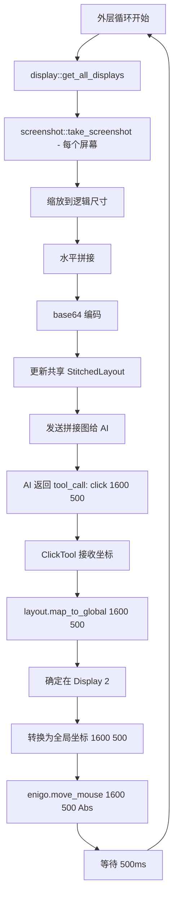

# 多屏幕截图拼接 + 坐标映射方案

## 1. 核心概念：macOS 坐标体系

macOS 有两套坐标体系需要区分：

- **逻辑坐标（points）**：`CGDisplayBounds` 返回的坐标，也是 enigo `Coordinate::Abs` 使用的坐标。Retina 屏幕上 1 point = 2 pixels。
- **像素坐标（pixels）**：`screencapture` 输出的实际图片像素。Retina 屏幕上图片尺寸是逻辑尺寸的 2 倍。

关键结论：**AI 看到的是像素坐标，enigo 需要的是逻辑坐标，两者之间差一个 scale factor。**

## 2. 数据结构设计

```rust
/// 单个显示器的布局信息
#[derive(Debug, Clone)]
pub struct DisplayInfo {
    /// screencapture 使用的显示器 ID（从 1 开始）
    pub display_id: u32,
    /// macOS 全局逻辑坐标中的位置和尺寸（points）
    /// 来自 CGDisplayBounds，主屏幕原点为 (0,0)
    pub bounds: LogicalRect,
    /// Retina 缩放因子（通常为 1.0 或 2.0）
    pub scale_factor: f64,
    /// 截图的实际像素尺寸 = bounds.size * scale_factor
    pub pixel_width: u32,
    pub pixel_height: u32,
}

#[derive(Debug, Clone, Copy)]
pub struct LogicalRect {
    pub x: f64,      // 全局逻辑 X
    pub y: f64,      // 全局逻辑 Y
    pub width: f64,   // 逻辑宽度（points）
    pub height: f64,  // 逻辑高度（points）
}

/// 拼接后的完整布局信息
#[derive(Debug, Clone)]
pub struct StitchedLayout {
    /// 所有显示器信息，按拼接顺序排列
    pub displays: Vec<DisplayInfo>,
    /// 每个显示器在拼接图中的像素偏移量（x_offset, y_offset）
    pub offsets: Vec<(u32, u32)>,
    /// 拼接图总尺寸（pixels）
    pub total_width: u32,
    pub total_height: u32,
}

/// 截图 + 布局的完整结果
pub struct MultiScreenCapture {
    /// 拼接后的图片 base64
    pub image_base64: String,
    /// 布局信息，用于坐标映射
    pub layout: StitchedLayout,
}
```

## 3. 获取屏幕布局信息

使用 `core-graphics` crate（项目已间接依赖 `core-foundation`，添加 `core-graphics` 很自然）：

```rust
use core_graphics::display::{CGDisplay, CGRect};

fn get_display_info(display_id: u32) -> Result<DisplayInfo> {
    // CGDirectDisplayID 就是 u32
    // 但 screencapture 的 -D 参数是从 1 开始的序号，不是 CGDirectDisplayID
    // 需要通过 CGGetActiveDisplayList 获取真实 ID 列表
    
    let cg_displays = CGDisplay::active_displays()?;
    // cg_displays[0] 对应 screencapture -D1
    // cg_displays[1] 对应 screencapture -D2
    
    let cg_id = cg_displays[(display_id - 1) as usize];
    let cg_display = CGDisplay::new(cg_id);
    
    let bounds: CGRect = cg_display.bounds();
    let mode = cg_display.display_mode().unwrap();
    
    // scale_factor = pixel_width / logical_width
    let scale_factor = mode.pixel_width() as f64 / mode.width() as f64;
    
    Ok(DisplayInfo {
        display_id,
        bounds: LogicalRect {
            x: bounds.origin.x,
            y: bounds.origin.y,
            width: bounds.size.width,
            height: bounds.size.height,
        },
        scale_factor,
        pixel_width: mode.pixel_width() as u32,
        pixel_height: mode.pixel_height() as u32,
    })
}
```

## 4. 截图拼接策略

### 方案选择：水平拼接（简单直接）

不按实际屏幕物理排列拼接，而是简单地**从左到右水平拼接**。原因：
- 实现简单，不需要处理屏幕间的间隙和对齐
- AI 只需要知道坐标在哪个区域，不需要理解物理布局
- 避免不同分辨率/缩放率屏幕拼接时的空白区域问题

### Retina 处理策略

`screencapture` 默认输出 2x 像素图片。为了减小发送给 AI 的图片体积，**将所有截图统一缩放到 1x 逻辑尺寸后再拼接**。

这样做的好处：
- 拼接图中的像素坐标 ≈ 逻辑坐标（points），映射更简单
- 图片体积减半，API 调用更快更省钱
- 不同 scale factor 的屏幕（如外接 1x 显示器 + 内置 2x Retina）拼接后尺寸一致

### 拼接流程

```
screencapture -D1 → 2880x1800 pixels (Retina 2x)
screencapture -D2 → 1920x1080 pixels (外接 1x)

↓ 缩放到逻辑尺寸

Display 1: 1440x900 pixels (÷2)
Display 2: 1920x1080 pixels (÷1, 不变)

↓ 水平拼接（高度不同时，顶部对齐，底部留白）

拼接图: 3360 x 1080 pixels
         |← 1440 →|← 1920 →|
```

### 需要的依赖

```toml
[dependencies]
image = "0.25"          # PNG 解码、缩放、拼接
core-graphics = "0.24"  # macOS 显示器信息
```

### 拼接伪代码

```rust
use image::{DynamicImage, GenericImageView, ImageBuffer, RgbaImage};

fn stitch_screenshots(
    screenshots: &[(Vec<u8>, DisplayInfo)],  // (PNG  display info)
) -> Result<(Vec<u8>, StitchedLayout)> {
    let mut images: Vec<DynamicImage> = Vec::new();
    let mut offsets: Vec<(u32, u32)> = Vec::new();
    
    // 1. 解码并缩放到逻辑尺寸
    for (png_bytes, info) in screenshots {
        let img = image::load_from_memory(png_bytes)?;
        let logical_w = info.bounds.width as u32;
        let logical_h = info.bounds.height as u32;
        let resized = img.resize_exact(logical_w, logical_h, image::imageops::FilterType::Lanczos3);
        images.push(resized);
    }
    
    // 2. 计算拼接尺寸
    let total_width: u32 = images.iter().map(|img| img.width()).sum();
    let total_height: u32 = images.iter().map(|img| img.height()).max().unwrap_or(0);
    
    // 3. 创建画布并拼接
    let mut canvas = RgbaImage::new(total_width, total_height);
    let mut x_offset = 0u32;
    
    for img in &images {
        image::imageops::overlay(&mut canvas, &img.to_rgba8(), x_offset as i64, 0);
        offsets.push((x_offset, 0));
        x_offset += img.width();
    }
    
    // 4. 编码为 PNG
    let mut png_bytes = Vec::new();
    canvas.save_to(&mut Cursor::new(&mut png_bytes), image::ImageFormat::Png)?;
    
    Ok((png_bytes, StitchedLayout { displays, offsets, total_width, total_height }))
}
```

## 5. 坐标映射

### 映射方向：拼接图像素坐标 → macOS 全局逻辑坐标

由于拼接图已经缩放到逻辑尺寸，映射非常直接：

```rust
impl StitchedLayout {
    /// 将拼接图上的坐标映射为 macOS 全局逻辑坐标（供 enigo 使用）
    pub fn map_to_global(&self, img_x: i32, img_y: i32) -> Result<(i32, i32)> {
        // 1. 确定点击在哪个显示器区域
        for (i, (offset_x, offset_y)) in self.offsets.iter().enumerate() {
            let display = &self.displays[i];
            let local_x = img_x - *offset_x as i32;
            let local_y = img_y - *offset_y as i32;
            
            let logical_w = display.bounds.width as i32;
            let logical_h = display.bounds.height as i32;
            
            if local_x >= 0 && local_x < logical_w && local_y >= 0 && local_y < logical_h {
                // 2. 加上该显示器在全局坐标系中的偏移
                let global_x = display.bounds.x as i32 + local_x;
                let global_y = display.bounds.y as i32 + local_y;
                return Ok((global_x, global_y));
            }
        }
        
        Err(anyhow!("坐标 ({}, {}) 不在任何显示器范围内", img_x, img_y))
    }
}
```

### 映射示例

```
用户有两个屏幕：
  Display 1 (主屏): CGDisplayBounds = {x:0, y:0, w:1440, h:900}, Retina 2x
  Display 2 (右侧): CGDisplayBounds = {x:1440, y:0, w:1920, h:1080}, 1x

拼接图（逻辑尺寸）：3360 x 1080
  Display 1 区域: [0, 0] ~ [1440, 900]
  Display 2 区域: [1440, 0] ~ [3360, 1080]

AI 给出坐标 (1600, 500)：
  → 落在 Display 2 区域
  → local_x = 1600 - 1440 = 160
  → local_y = 500 - 0 = 500
  → global_x = 1440 + 160 = 1600  (恰好一致，因为 Display 2 紧邻 Display 1)
  → global_y = 0 + 500 = 500
  → enigo.move_mouse(1600, 500, Coordinate::Abs)
```

## 6. 模块划分

### 新增文件：`src/display.rs`

集中管理显示器信息获取、截图拼接、坐标映射三个职责。

```rust
// src/display.rs

pub struct DisplayInfo { ... }
pub struct LogicalRect { ... }
pub struct StitchedLayout { ... }
pub struct MultiScreenCapture { ... }

/// 获取所有活跃显示器的布局信息
pub fn get_all_displays() -> Result<Vec<DisplayInfo>> { ... }

/// 截取所有屏幕并拼接成一张图
pub fn capture_and_stitch() -> ReScreenCapture> { ... }

impl StitchedLayout {
    /// 拼接图坐标 → 全局逻辑坐标
    pub fn map_to_global(&self, img_x: i32, img_y: i32) -> Result<(i32, i32)> { ... }
}
```

### 为什么不放在 `screenshot.rs` 或 `mouse.rs`

- `screenshot.rs` 只负责截图采集，不应该知道拼接和坐标映射
- `mouse.rs` 只负责鼠标操作，不应该知道屏幕布局
- `display.rs` 是一个新的关注点：**多屏幕布局感知**，包含获取布局、拼接、映射的完整链路

## 7. 集成方式

### 7.1 `screen_agent.rs` 改动

```rust
// 改动前
let screenshots = screenshot::take_screenshot(Some(1))?;
let screenshot_base64 = screenshots.first()?.image_base64.as_str();

// 改动后
let capture = display::capture_and_stitch()?;
let screenshot_base64 = capture.image_base64.as_str();
// capture.layout 保存下来，供工具层使用
```

`StitchedLayout` 需要通过 `Arc<Mutex<StitchedLayout>>` 共享给工具层，每轮截图时更新。

### 7.2 工具层坐标转换

两种方案：

**方案 A：工具内部自动转换（推荐）**

鼠标工具（click, hover, drag 等）接收 AI 给出的拼接图坐标，内部调用 `layout.map_to_global()` 转换后再调用 enigo。

```rust
pub struct ClickTool {
    pub layout: Arc<Mutex<StitchedLayout>>,
}

impl Tool for ClickTool {
    async fn call(&self, args: ClickArgs) -> Result<String, ToolError> {
        let layout = self.layout.lock().unwrap();
        let (global_x, global_y) = layout.map_to_global(args.x, args.y)
            .map_err(|e| ToolError(e.to_string()))?;
        crate::mouse::click(global_x, global_y).map_err(ToolError)?;
        Ok(format!("已点击坐标 ({}, {}) -> 全局 ({}, {})", args.x, args.y, global_x, global_y))
    }
}
```

优点：AI 不需要知道坐标映射的存在，直接给拼接图上的坐标即可。
缺点：所有鼠标工具都需要持有 layout 引用。

**方案 B：screen_agent 层统一转换**

不改工具层，在 screen_agent 的 PREAMBLE 中告诉 AI 全局坐标体系，让 AI 直接给出全局坐标。

缺点：AI 需要理解多屏幕坐标映射，增加出错概率。不推荐。

### 7.3 PREAMBLE 更新

```text
## 屏幕信息
你看到的截图是所有屏幕从左到右水平拼接的结果。
截图中的坐标可以直接用于鼠标操作工具，系统会自动映射到正确的屏幕。
```

### 7.4 完整数据流



## 8. 依赖变更

```toml
# Cargo.toml 新增
[dependencies]
image = "0.25"           # PNG 解码、缩放、拼接
core-graphics = "0.24"   # macOS 显示器布局信息
```

## 9. 文件变更清单

| 文件 | 变更类型 | 说明 |
|------|---------|------|
| `src/display.rs` | 新增 | DisplayInfo, StitchedLayout, capture_and_stitch(), map_to_global() |
| `src/lib.rs` | 修改 | 添加 `pub mod display;` |
| `src/screenshot.rs` | 修改 | `capture_single_display` 返回原始 PNG bytes（除了 base64），供 display 模块使用 |
| `src/screen_agent.rs` | 修改 | 使用 `display::capture_and_stitch()` 替代单屏截图；共享 layout 给工具 |
| `src/tools.rs` | 修改 | 鼠标类工具增加 `Arc<Mutex<StitchedLayout>>` 字段，call 中做坐标转换 |
| `Cargo.toml` | 修改 | 添加 `image` 和 `core-graphics` 依赖 |

## 10. 边界情况处理

1. **单屏幕场景**：只有一个显示器时，拼接退化为单张缩放图，映射逻辑不变
2. **不同高度的屏幕**：顶部对齐，底部空白区域填充黑色；点击空白区域返回错误
3. **负坐标屏幕**：macOS 允许屏幕在主屏幕左侧/上方（负坐标），`CGDisplayBounds` 会返回负值，`map_to_global` 直接加上即可
4. **screencapture -D 编号与 CGDisplay ID 的对应**：通过 `CGDisplay::active_displays()` 获取有序列表，索引+1 即为 screencapture 的 -D 参数
