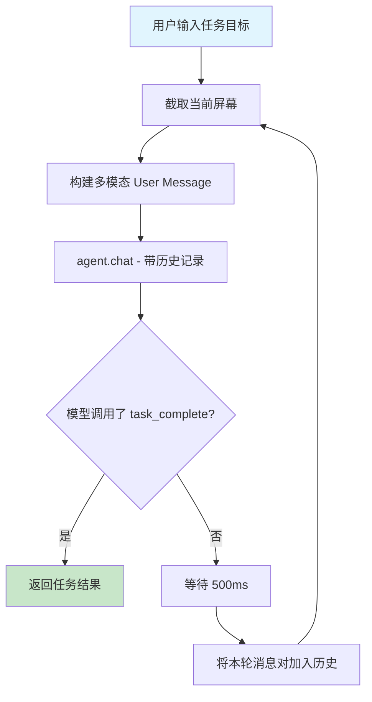
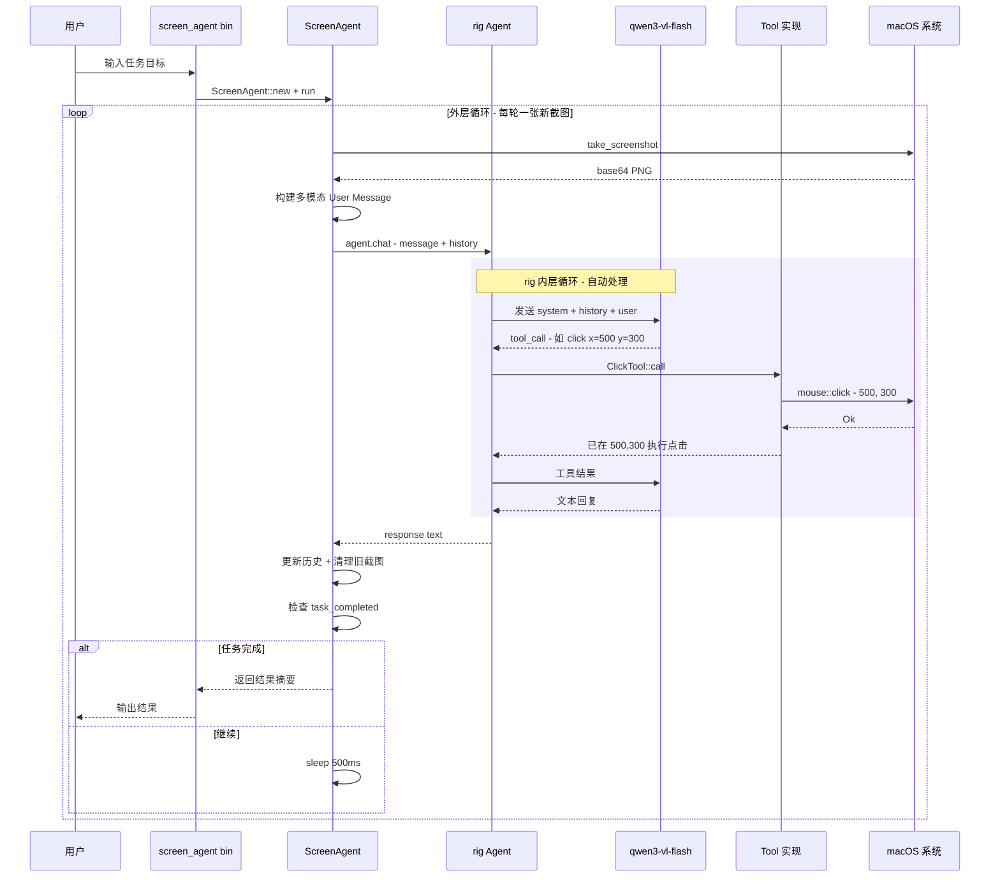

# Screen Agent 架构设计

## 1. 核心问题与解决思路

rig 的 `agent.chat()` 内部自动处理 tool call 循环（模型调工具 → 执行 → 结果回传 → 模型继续），但屏幕操作有一个特殊性：每次工具执行后屏幕状态都会改变，模型需要看到最新截图才能做出正确判断。

解决方案：双层循环架构。

- 内层循环（rig 自动处理）：模型调用一个工具 → 执行 → 返回结果 → 模型生成文本回复
- 外层循环（我们控制）：截图 → 构建多模态消息 → `agent.chat()` → 检查是否完成 → 重复

通过 preamble 强制约束模型每轮只执行一个操作，确保外层循环能在每次操作后注入新截图。

## 2. 上下文构建流程



## 3. 每轮消息结构

### 第 1 轮

```
System (preamble): 系统提示词（见第5节）

History: []

User Message:
  content: [
    UserContent::text("任务目标: 打开 Chrome 并访问 google.com\n\n请分析当前屏幕截图，决定下一步操作。"),
    UserContent::image_base64(screenshot_base64, PNG, Auto)
  ]
```

模型内部：调用 `open_application({app_name: "Google Chrome"})` → rig 执行 → 返回 "应用已打开" → 模型生成文本回复："已打开 Chrome 浏览器，下一步需要等待窗口加载后点击地址栏。"

### 第 2 轮

```
History: [
  Message::User { content: [text("任务目标: ..."), image_base64(旧截图)] },
  Message::Assistant { content: "已打开 Chrome 浏览器..." }
]

User Message:
  content: [
    UserContent::text("操作已执行完毕。这是当前最新的屏幕截图，请继续执行任务。"),
    UserContent::image_base64(新截图_base64, PNG, Auto)
  ]
```

### 历史记录优化

为避免上下文过长，历史记录中的旧截图需要被清理：

```rust
fn trim_history(history: &mut Vec<Message>, max_turns: usize) {
    // 1. 只保留最近 max_turns 轮对话
    // 2. 对于非最新轮次的 User 消息，移除 image_base64 内容，只保留文本
    // 这样历史记录只包含文字描述，当前截图始终是最新的
}
```

## 4. 文件结构与模块职责

```
src/
├── tools.rs            # 所有 rig Tool 实现（包装现有模块函数）
├── screen_agent.rs     # S构体 + 外层循环编排
├── mouse.rs            # 已有 - 需新增 click(x, y)
├── keyboard.rs         # 已有
├── app_manager.rs      # 已有
├── screenshot.rs       # 已有
├── ai.rs               # 已有
├── lib.rs              # 新增 mod tools; mod screen_agent;
└── bin/
    └── screen_agent.rs # CLI 入口
```

### 各模块职责

| 模块 | 职责 |
|------|------|
| `src/tools.rs` | 为每个操作实现 rig `Tool` trait，包装现有函数为 Agent 可调用的工具 |
| `src/screen_agent.rs` | `ScreenAgent` 结构体，持有 agent 实例和共享状态，实现外层截图-决策循环 |
| `src/bin/screen_agent.rs` | 解析命令行参数（任务目标），初始化 Agent，启动循环 |

## 5. 系统提示词（Preamble）

```text
你是一个 macOS 屏幕控制 Agent。你通过分析屏幕截图来理解当前界面状态，并调用工具执行操作来完成用户指定的任务。

## 核心规则

1. 每轮对话你只能执行【一个】工具调用。执行后立即停止，描述你做了什么以及观察到的结果。
2. 每轮你都会收到一张最新的屏幕截图，仔细分析截图内容后再决定操作。
3. 点击操作需要你根据截图中 UI 元素的位置估算坐标 (x, y)。
4. 任务完成后，必须调用 task_complete 工具并提供总结。
5. 如果连续 3 次操作没有进展，调用 task_complete 报告失败原因。

## 可用工具

- click: 左键点击指定坐标
- right_click: 右键点击指定坐标
- double_click: 双击指定坐标
- type_text: 输入文本
- press_key: 按下单个按键（enter/tab/escape 等）
- hotkey: 组合键（如 cmd+c, cmd+v）
- scroll: 在指定位置滚动
- drag: 从一个坐标拖拽到另一个坐标
- open_application: 打开应用程序
- focus_application: 切换应用焦点
- task_complete: 标记任务完成

## 输出格式

每次回复请包含：
1. 对当前屏幕状态的简要分析
2. 你决定执行的操作及理由
3. 执行后的预期效果
```

## 6. 工具定义清单

### 6.1 操作类工具

| 工具名 | Args 结构体 | 包装函数 |
|--------|------------|---------|
| `click` | `{ x: i32, y: i32 }` | 新增 `mouse::click()` |
| `right_click` | `{ x: i32, y: i32 }` | `mouse::right_click()` |
| `double_click` | `{ x: i32, y: i32 }` | `mouse::double_click()` |
| `type_text` | `{ text: String }` | `keyboard::type_text()` |
| `press_key` | `{ key: String }` | `keyboard::press_key()` |
| `hotkey` | `{ modifiers: Vec<String>, key: String }` | `keyboard::hotkey()` |
| `scroll` | `{ x: i32, y: i32, direction: String, clicks: i32 }` | `mouse::scroll()` |
| `drag` | `{ from_x: i32, from_y: i32, to_x: i32, to_y: i32 }` | `mouse::drag()` |
| `open_application` | `{ app_name: String }` | `app_manager::open_application()` |
| `focus_application` | `{ app_name: String }` | `app_manager::focus_application()` |

 6.2 控制类工具

| 工具名 | Args 结构体 | 作用 |
|--------|------------|------|
| `task_complete` | `{ summary: String, success: bool }` | 标记任务完成，通过共享状态通知外层循环 |

### 6.3 Tool 实现伪代码

```rust
// --- 错误类型 ---
#[derive(Debug, thiserror::Error)]
#[error("工具执行错误: {0}")]
pub struct ToolError(String);

// --- Click 工具示例 ---
#[derive(Deserialize)]
pub struct ClickArgs {
    pub x: i32,
    pub y: i32,
}

pub struct ClickTool;

impl Tool for ClickTool {
    const NAME: &'static str = "click";
    type Error = ToolError;
    type Args = ClickArgs;
    type Output = String;

    async fn definition(&self, _prompt: String) -> ToolDefinition {
        ToolDefinition {
            name: "click".into(),
            description: "在屏幕指定坐标执行左键单击".into(),
            parameters: json!({
                "type": "object",
                "properties": {
                    "x": { "type": "integer", "description": "点击位置的 X 坐标" },
                    "y": { "type": "integer", "description": "点击位置的 Y 坐标" }
                },
                "required": ["x", "y"]
            }),
        }
    }

    async fn call(&self, args: Self::Args) -> Result<Self::Output, Self::Error> {
        mouse::click(args.x, args.y).map_err(|e| ToolError(e))?;
        Ok(format!("已在 ({}, {}) 执行左键点击", args.x, args.y))
    }
}

// --- TaskComplete 工具 ---
#[derive(Deserialize)]
pub struct TaskCompleteArgs {
    pub summary: String,
    pub success: bool,
}

pub struct TaskCompleteTool {
    pub completed: Arc<AtomicBool>,
    pub result_summary: Arc<Mutex<String>>,
}

impl Tool for TaskCompleteTool {
    const NAME: &'static str = "task_complete";
    type Error = ToolError;
    type Args = TaskCompleteArgs;
    type Output = String;

    async fn call(&self, args: Self::Args) -> Result<Self::Output, Self::Error> {
        self.completed.store(true, Ordering::SeqCst);
        *self.result_summary.lock().unwrap() = args.summary.clone();
        Ok(format!("任务已标记为完成: {}", args.summary))
    }
}
```

## 7. ScreenAgent 外层循环

```rust
pub struct ScreenAgent {
    agent: Agent<openai::CompletionModel>,
    task_completed: Arc<AtomicBool>,
    result_summary: Arc<Mutex<String>>,
    max_iterations: usize,
}

impl ScreenAgent {
    pub fn new(task_goal: &str) -> Result<Self> {
        let client = ai::get_openai_client()?;
        let config = ai::load_openai_config()?;

        let task_completed = Arc::new(AtomicBool::new(false));
        let result_summary = Arc::new(Mutex::new(String::new()));

        let agent = client
            .agent(&config.model_name)
            .preamble(PREAMBLE)
            .tool(ClickTool)
            .tool(RightClickTool)
            .tool(DoubleClickTool)
            .tool(TypeTextTool)
            .tool(PressKeyTool)
            .tool(HotkeyTool)
            .tool(ScrollTool)
            .tool(DragTool)
            .tool(OpenApplicationTool)
            .tool(FocusApplicationTool)
            .tool(TaskCompleteTool {
                completed: task_completed.clone(),
                result_summary: result_summary.clone(),
            })
            .build();

        Ok(Self {
            agent,
            task_completed,
            result_summary,
            max_iterations: 30,
        })
    }

    pub async fn run(&self, task_goal: &str) -> Result<String> {
        let mut history: Vec<Message> = vec![];
        let mut iteration = 0;

        loop {
            iteration += 1;
            if iteration > self.max_iterations {
                return Err(anyhow!("超过最大迭代次数 {}", self.max_iterations));
            }

            // 1. 截取当前屏幕
            let screenshots = screenshot::take_screenshot(None)?;
            let screenshot_base64 = &screenshots[0].image_base64;

            // 2. 构建本轮 User 消息
            let user_text = if iteration == 1 {
                format!("任务目标: {}\n\n请分析当前屏幕截图，决定下一步操作。", task_goal)
            } else {
                "操作已执行完毕。这是当前最新的屏幕截图，请继续执行任务。".to_string()
            };

            let user_message = Message::User {
                content: OneOrMany::many(vec![
                    UserContent::text(user_text),
                    UserContent::image_base64(
                        screenshot_base64.clone(),
                        Some(ImageMediaType::PNG),
                        Some(ImageDetail::Auto),
                    ),
                ])
                .expect("内容不为空"),
            };

            // 3. 调用 agent.chat()（rig 内部处理 tool call 循环）
            let response = self.agent.chat(&user_message, history.clone()).await?;

            println!("[轮次 {}] Agent: {}", iteration, response);

            // 4. 将本轮对话加入历史（清理旧截图）
            history.push(user_message);
            history.push(Message::assistant(&response));
            trim_history(&mut history, 10);

            // 5. 检查任务是否完成
            if self.task_completed.load(Ordering::SeqCst) {
                let summary = self.result_summary.lock().unwrap().clone();
                return Ok(summary);
            }

            // 6. 等待操作生效
            tokio::time::sleep(Duration::from_millis(500)).await;
        }
    }
}
```

## 8. 历史记录管理

```rust
/// 清理历史记录：
/// - 保留最近 max_turns 轮对话
/// - 移除非最新轮次中的图片内容，只保留文本
fn trim_history(history: &mut Vec<Message>, max_turns: usize) {
    let max_messages = max_turns * 2; // 每轮 = 1 user + 1 assistant

    // 截断到最大长度
    if history.len() > max_messages {
        *history = history.split_off(history.len() - max_messages);
    }

    // 对除最后一条 User 消息外的所有 User 消息，移除图片内容
    let len = history.len();
    for i in 0..len.saturating_sub(2) {
        if let Message::User { content } = &mut history[i] {
            // 只保留文本部分，移除 image_base64
            *content = filter_text_only(content);
        }
    }
}
```

## 9. 入口程序

```rust
// src/bin/screen_agent.rs
use anyhow::Result;
use uicontrol::screen_agent::ScreenAgent;

#[tokio::main]
async fn main() -> Result<()> {
    tracing_subscriber::fmt::init();

    let task_goal = std::env::args()
        .nth(1)
        .unwrap_or_else(|| "打开 Safari 浏览器".to_string());

    println!("Screen Agent 启动，任务目标: {}", task_goal);

    let agent = ScreenAgent::new(&task_goal)?;
    let result = agent.run(&task_goal).await?;

    println!("任务完成: {}", result);
    Ok(())
}
```

## 10. 需要新增/修改的内容

| 文件 | 变更 |
|------|------|
| `src/mouse.rs` | 新增 `click(x: i32, y: i32)` 左键单击函数 |
| `src/tools.rs` | 新建，实现 11 个 rig Tool |
| `src/screen_agent.rs` | 新建，ScreenAgent + 外层循环 |
| `src/bin/screen_agent.rs` | 新建，CLI 入口 |
| `src/lib.rs` | 新增 `mod tools; mod screen_agent;` |
| `Cargo.toml` | 新增 `thiserror` 依赖，新增 `[[bin]]` 配置 |

## 11. 完整数据流时序图


