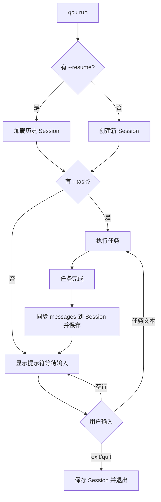

# qcu 会话管理架构设计

## 1. 现状分析

### 当前工作流程
```
用户 → qcu run "任务" → ScreenAgentV2::run() → 任务完成 → 进程退出
```

### 当前代码结构
- [`src/bin/screen_agent_v2.rs`](src/bin/screen_agent_v2.rs) — CLI 入口，clap 解析后调用 `ScreenAgentV2::run(task_goal)`
- [`src/screen_agent_v2.rs`](src/screen_agent_v2.rs) — 核心 agent 逻辑，`run()` 是一个 ~640 行的单体静态方法
- 聊天记录保存在 `data/chat_{timestamp}.json`，格式为 `SessionChatLog`（仅用于日志回顾，不可恢复）

### 核心问题
1. `ScreenAgentV2::run()` 内部自建 `messages: Vec<Value>`，任务完成后丢弃
2. 消息历史包含 base64 截图（不适合持久化）
3. 没有会话概念，每次运行都是全新上下文
4. 任务完成后进程直接退出

---

## 2. 目标架构

```
用户 → qcu run → 交互式 REPL 循环
                    ├── 输入任务 → ScreenAgentV2::run_task() → 任务完成 → 等待下一个任务
                    ├── 输入任务 → ...
                    └── 输入 exit → 保存会话 → 退出

用户 → qcu run --resume <id> → 加载历史会话 → 交互式 REPL 循环（带上下文）
用户 → qcu sessions → 列出所有会话
用户 → qcu sessions delete <id> → 删除会话
```

---

## 3. 数据结构设计

### 3.1 Session 结构

```rust
// src/session.rs

use serde::{Deserialize, Serialize};
use serde_json::Value;

#[derive(Debug, Clone, Serialize, Deserialize)]
pub struct Session {
    /// 唯一会话 ID（Unix 时间戳，与现有 chat log 命名风格一致）
    pub id: String,
    /// 会话创建时间（ISO 8601）
    pub created_at: String,
    /// 最后更新时间（ISO 8601）
    pub updated_at: String,
    /// 会话标题（取自第一个任务的前 50 个字符）
    pub title: String,
    /// 持久化的消息历史（文本消息，不含图片 base64）
    pub messages: Vec<SessionMessage>,
}

#[deve(Debug, Clone, Serialize, Deserialize)]
pub struct SessionMessage {
    pub role: String,           // "system" | "user" | "assistant" | "tool"
    pub content: String,        // 纯文本内容
    #[serde(skip_serializing_if = "Option::is_none")]
    pub tool_call_id: Option<String>,
    #[serde(skip_serializing_if = "Option::is_none")]
    pub tool_calls_summary: Option<Vec<ToolCallSummary>>,
}

#[derive(Debug, Clone, Serialize, Deserialize)]
pub struct ToolCallSummary {
    pub id: String,
    pub name: String,
    pub arguments: String,
}
```

### 3.2 存储格式

- 路径：`data/sessions/{session_id}.json`
- 格式：JSON，`Session` 结构直接序列化
- 旧的 `data/chat_{timestamp}.json` 聊天日志保持不变（用于调试回顾）

### 3.3 消息持久化策略

从运行时 `messages: Vec<Value>`（OpenAI 格式）转换为 `Vec<SessionMessage>` 时：

| 运行时消息类型 | 持久化处理 |
|---|---|
| `system` | 不持久化（每次启动重新构建，因为包含动态的应用列表和快捷键） |
| `user`（含 `image_url`） | 只保留 `text` 部分，丢弃 `image_url` |
| `assistant`（含 `tool_calls`） | 保留文本内容 + tool_calls 摘要（id/name/arguments） |
| `tool` | 保留 tool_call_id 和结果文本 |

恢复会话时，从 `Vec<SessionMessage>` 重建为 `Vec<Value>`（OpenAI 格式），system prompt 重新生成。

---

## 4. 模块设计

### 4.1 新增文件

```
src/session.rs          — Session 结构体、序列化/反序列化、CRUD 操作
```

### 4.2 修改文件

```
src/lib.rs              — 添加 pub mod session;
src/screen_agent_v2.rs  — 重构 run() 方法，拆分为可复用的组件
src/bin/screen_agent_v2.rs — 新增 CLI 子命令 + 交互式 REPL
```

### 4.3 `src/session.rs` 公开接口

```rust
impl Session {
    /// 创建新会话
    pub fn new() -> Self;

    /// 从文件加载会话
    pub fn load(session_id: &str) -> Result<Self>;

    /// 保存会话到文件
    pub fn save(&self) -> Result<()>;

    /// 删除会话文件
    pub fn delete(session_id: &str) -> Result<()>;

    /// 列出所有会话（按更新时间倒序）
    pub fn list_all() -> Result<Vec<Session>>;

    /// 将运行时 messages (OpenAI 格式) 转换并追加到会话
    pub fn append_from_runtime_messages(&mut self, messages: &[Value]);

    /// 将会话消息恢复为运行时 messages (OpenAI 格式)
    pub fn to_runtime_messages(&self) -> Vec<Value>;

    /// 更新标题（从第一个用户消息提取）
    pub fn update_title_if_empty(&mut self, task: &str);
}
```

---

## 5. ScreenAgentV2 重构方案

### 5.1 当前 `run()` 签名

```rust
pub async fn run(task_goal: &str) -> Result<String>
```

### 5.2 重构后签名

```rust
impl ScreenAgentV2 {
    /// 执行单个任务，返回结果。messages 由调用方管理。
    pub async fn run_task(
        task_goal: &str,
        messages: &mut Vec<Value>,
    ) -> Result<String>;
}
```

关键变化：
1. `messages` 从内部变量变为外部传入的可变引用
2. system prompt 的构建提取为独立函数 `build_system_prompt() -> String`
3. 调用方（bin）负责：
   - 初始化 messages（新会话）或从 Session 恢复 messages
   - 每次任务完成后，将 messages 同步到 Session 并保存
   - 管理交互式循环

### 5.3 重构步骤（渐进式）

1. 将 `build_system_prompt()`、`get_tools_definition()` 等提取为模块级公开函数
2. 将 `run()` 的 messages 参数外部化
3. 保留现有的 `SessionChatLog` 聊天日志功能不变（兼容）
4. 在 bin 层添加 Session 管理和 REPL 循环

---

## 6. CLI 设计

### 6.1 命令结构

```rust
#[derive(Debug, Parser)]
#[command(name = "qcu", about = "qcu 屏幕控制 Agent")]
struct Cli {
    #[command(subcommand)]
    command: Option<Commands>,

    /// 任务目标（省略子命令时直接传入）
    task: Option<String>,
}

#[derive(Debug, Subcommand)]
enum Commands {
    /// 启动会话（默认进入交互模式）
    Run {
        /// 立即执行的任务
        #[arg(short, long)]
        task: Option<String>,
        /// 恢复历史会话
        #[arg(short, long)]
        resume: Option<String>,
    },
    /// 会话管理
    Sessions {
        #[command(subcommand)]
        action: Option<SessionAction>,
    },
    /// 交互式登录
    Login,
    /// 配置管理
    Config {
        #[command(subcommand)]
        action: ConfigAction,
    },
}

#[derive(Debug, Subcommand)]
enum SessionAction {
    /// 列出所有会话（默认行为）
    List,
    /// 删除指定会话
    Delete {
        session_id: String,
    },
}
```

### 6.2 命令示例

```bash
# 启动新会话，进入交互模式
qcu run

# 启动新会话并立即执行任务，完成后进入交互模式
qcu run --task "打开浏览器访问 example.com"

# 恢复历史会话
qcu run --resume 1772041211

# 列出所有历史会话
qcu sessions
qcu sessions list

# 删除指定会话
qcu sessions delete 1772041211

# 向后兼容：直接传任务（等同于 qcu run --task）
qcu "打开浏览器"
```

---

## 7. 交互式 REPL 设计

### 7.1 流程图



### 7.2 REPL 伪代码

```rust
async fn interactive_loop(session: &mut Session, initial_task: Option<String>) -> Result<()> {
    let system_prompt = build_system_prompt()?;
    let mut messages = if session.messages.is_empty() {
        vec![json!({"role": "system", "content": system_prompt})]
    } else {
        let mut msgs = session.to_runtime_messages();
        // 替换 system prompt 为最新版本
        msgs[0] = json!({"role": "system", "content": system_prompt});
        msgs
    };

    // 如果有初始任务，先执行
    if let Some(task) = initial_task {
        session.update_title_if_empty(&task);
        let result = ScreenAgentV2::run_task(&task, &mut messages).await?;
        session.append_from_runtime_messages(&messages);
        session.save()?;
        println!("✅ 任务完成: {}", result);
    }

    // 交互循环
    loop {
        print!("qcu> ");
        io::stdout().flush()?;

        let mut input = String::new();
        io::stdin().read_line(&mut input)?;
        let input = input.trim();

        match input {
            "" => continue,
            "exit" | "quit" => {
                session.save()?;
                println!("👋 会话已保存，再见！");
                break;
            }
            task => {
                session.update_title_if_empty(task);
                let result = ScreenAgentV2::run_task(task, &mut messages).await?;
                session.append_from_runtime_messages(&messages);
                session.save()?;
                println!("✅ 任务完成: {}", result);
            }
        }
    }
    Ok(())
}
```

---

## 8. 会话列表展示格式

```
$ qcu sessions

📋 历史会话列表：
━━━━━━━━━━━━━━━━━━━━━━━━━━━━━━━━━━━━━━━━━━━━━━━━━━━━━━━━━━━━
  ID            创建时间              消息数  标题
  1772041211    2026-02-26 03:40      12     解决当前浏览器中的题目...
  1772041990    2026-02-26 03:53       8     打开浏览器访问 example.com
  1772042283    2026-02-26 03:58       4     截图并保存到桌面
━━━━━━━━━━━━━━━━━━━━━━━━━━━━━━━━━━━━━━━━━━━━━━━━━━━━━━━━━━━━

恢复会话: qcu run --resume <ID>
```

---

## 9. 实现任务清单

以下是按执行顺序排列的实现步骤：

1. 创建 `src/session.rs` — Session 结构体 + CRUD + 序列化转换
2. 在 `src/lib.rs` 中添加 `pub mod session;`
3. 重构 `src/screen_agent_v2.rs`:
   - 提取 `build_system_prompt()` 为公开函数
   - 将 `run()` 改为 `run_task(task_goal, &mut messages)` 签名
   - 保留 `SessionChatLog` 聊天日志功能
4. 改造 `src/bin/screen_agent_v2.rs`:
   - 扩展 CLI 命令（`Sessions` 子命令 + `Run` 的 `--resume` 参数）
   - 实现交互式 REPL 循环
   - 集成 Session 的创建/加载/保存
5. 测试验证：`cargo check` 通过

---

## 10. 风险与注意事项

1. 会话恢复时没有截图上下文 — AI 会在第一轮重新截图，这是可接受的。恢复后 AI 能看到之前的文本对话历史，知道之前做了什么。
2. system prompt 每次重新生成 — 因为包含动态的已安装应用列表和运行中应用列表，不应持久化。
3. 消息历史可能很长 — 暂不做截断，后续可考虑添加 token 计数和滑动窗口。
4. 旧的 `data/chat_*.json` 日志文件 — 保持不变，与新的 `data/sessions/` 目录并存。
5. Ctrl+C 处理 — 需要在 REPL 层也注册信号处理，确保会话被保存。
